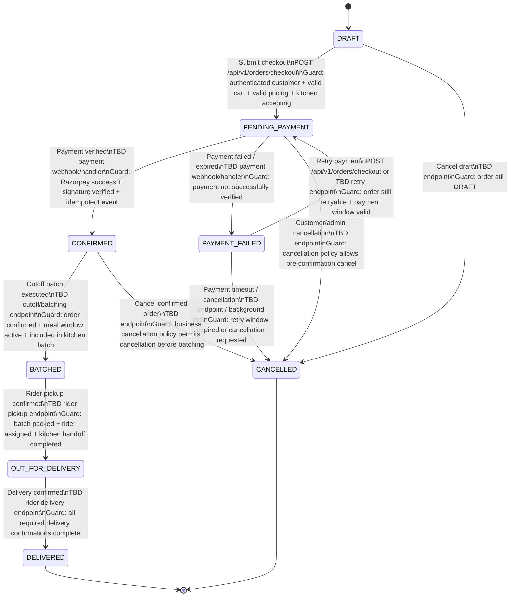
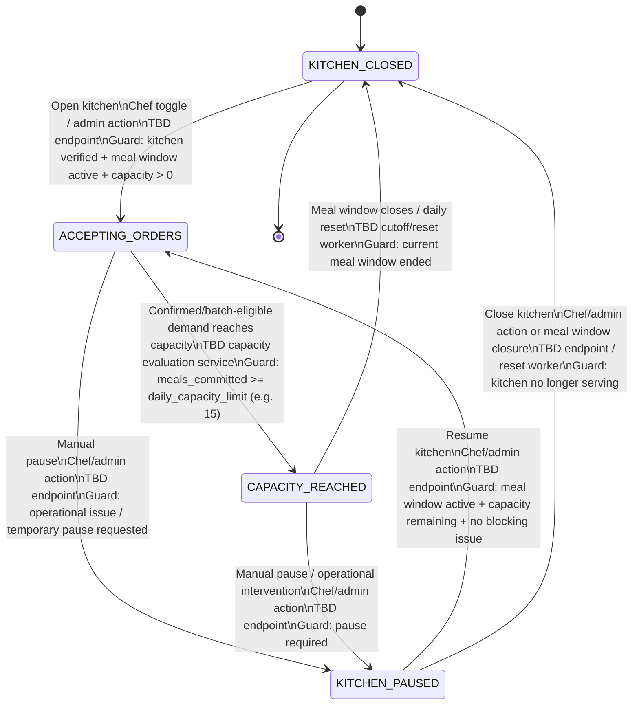
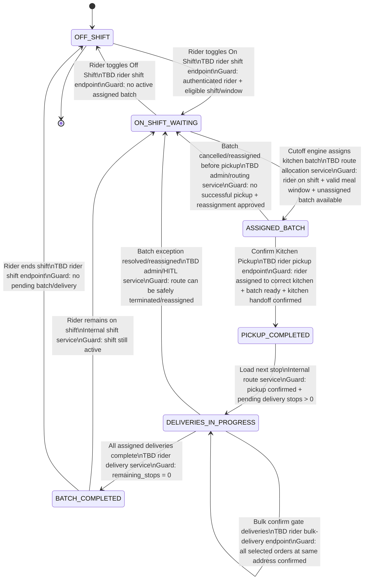
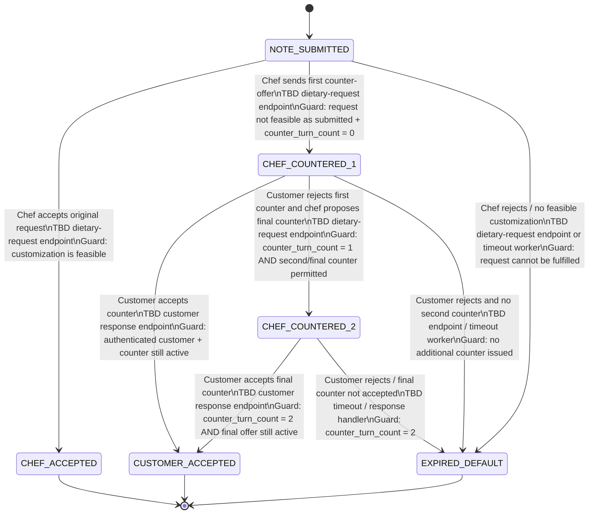
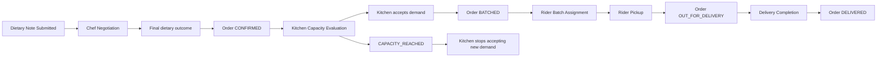

# HOMAATRI — CORE OPERATIONAL STATE MACHINES
## Mermaid.js State Diagrams + State Transition Tables

**Document Version:** 1.0  
**Basis:** `Homaatri_Full_Stack_BRD_SRS_v1.md`  
**Role:** Lead Software Architect  
**Scope:** Order, Kitchen Capacity, Rider Shift/Batch, Dietary Customization lifecycles

---

## 0. Architecture Note: Source-Defined vs. Technical Design

This document is derived from the current Homaatri BRD/SRS.

Where the BRD/SRS explicitly defines a state, workflow, event, cutoff, or endpoint, it is treated as a source-defined requirement.

Where the BRD/SRS does **not** define an exact API endpoint, state transition, or webhook contract, this document uses:

> `TBD — API/contract not defined in BRD/SRS`

This is intentional. The BRD/SRS itself states that a complete API catalog and formal webhook contract are not yet defined, and explicitly recommends the order state machine as a subsequent technical artifact.

The following are therefore **architectural transition contracts to be finalized**, not claims that these endpoints already exist.

---

# 1. ORDER LIFECYCLE STATE MACHINE

## 1.1 Source Baseline

The BRD/SRS defines the customer/admin order progression as:

```text
DRAFT
  ↓
PENDING_PAYMENT
  ↓
CONFIRMED
  ↓
BATCHED
  ↓
OUT_FOR_DELIVERY
  ↓
DELIVERED
```

It also requires:
- payment failure handling;
- server-side validation;
- idempotent payment operations;
- Razorpay payment verification;
- auditability;
- customer support/HITL escalation.

The only explicitly named checkout endpoint in the BRD/SRS is:

`POST /api/v1/orders/checkout`

The formal API catalog and webhook catalog remain TBD.

---

## 1.2 Mermaid — Order State Diagram



---

## 1.3 Order Transition Matrix

| ID | From | Event / Trigger | To | API / Service Responsible | Guard Conditions |
|---|---|---|---|---|---|
| ORD-01 | DRAFT | Customer submits checkout | PENDING_PAYMENT | `POST /api/v1/orders/checkout` | Authenticated customer; cart valid; kitchen accepting; menu/item availability valid; server recalculates totals |
| ORD-02 | DRAFT | Customer cancels draft | CANCELLED | TBD order-cancel endpoint | Order remains DRAFT; cancellation allowed |
| ORD-03 | PENDING_PAYMENT | Razorpay payment success | CONFIRMED | TBD Razorpay webhook/verification handler | Signature verified; payment belongs to order; amount matches server-side amount; event idempotent |
| ORD-04 | PENDING_PAYMENT | Payment failure/expiry | PAYMENT_FAILED | TBD Razorpay webhook/handler or payment timeout worker | Payment not successfully verified |
| ORD-05 | PENDING_PAYMENT | Cancel/timeout before payment | CANCELLED | TBD cancellation/expiry worker | Cancellation/timeout policy permits transition |
| ORD-06 | PAYMENT_FAILED | Customer retries payment | PENDING_PAYMENT | `POST /api/v1/orders/checkout` or TBD retry endpoint | Order remains retryable; payment retry window open |
| ORD-07 | PAYMENT_FAILED | Retry window expires / cancellation | CANCELLED | TBD cancellation worker/endpoint | No successful retry before expiry |
| ORD-08 | CONFIRMED | Meal cutoff batch runs | BATCHED | TBD cutoff engine / batching service | Order confirmed; correct meal window; kitchen available; order included in valid batch |
| ORD-09 | CONFIRMED | Cancellation requested | CANCELLED | TBD cancellation endpoint | Business cancellation policy permits cancellation before batching |
| ORD-10 | BATCHED | Kitchen packed + rider pickup confirmed | OUT_FOR_DELIVERY | TBD rider pickup endpoint/service | Batch packed; assigned rider; pickup handoff successful |
| ORD-11 | OUT_FOR_DELIVERY | Delivery completion | DELIVERED | TBD rider delivery endpoint/service | Required delivery confirmation completed |
| ORD-12 | OUT_FOR_DELIVERY | Delivery exception | Remains OUT_FOR_DELIVERY or escalated | TBD exception endpoint | Customer unavailable/address issue; HITL may intervene |

---

## 1.4 Order Lifecycle Guard Rules

### Payment Guards

1. **Never trust client-side totals.**
2. Server recomputes the payable amount.
3. Razorpay webhook/provider event must be verified.
4. Payment events must be idempotent.
5. A duplicate payment webhook must not create duplicate state transitions.

### Batch Guards

An order must not become `BATCHED` unless:

```text
order.status = CONFIRMED
AND
meal_window is valid
AND
order is eligible for the active cutoff batch
AND
kitchen capacity permits inclusion
```

### Delivery Guards

An order must not become `OUT_FOR_DELIVERY` unless:
- kitchen batch is packed;
- rider assignment exists;
- rider has confirmed pickup.

### Completion Guard

An order must not become `DELIVERED` unless the delivery workflow has recorded the required confirmation.

---

# 2. KITCHEN DAILY CAPACITY STATE MACHINE

## 2.1 Source Baseline

The BRD/SRS explicitly requires:
- an `Accepting Orders` / `Kitchen Closed` master switch;
- daily meal capacity limits;
- capacity monitoring;
- examples such as `8 / 15 meals`;
- lunch cutoff at 11:30 AM;
- dinner cutoff at 6:30 PM;
- admin monitoring and cutoff batching.

The source does **not** define a complete state machine for `CAPACITY_REACHED` or `KITCHEN_PAUSED`.

Therefore, the transitions below distinguish:
- source-aligned behavior;
- technical interpretation requiring confirmation.

---

## 2.2 Mermaid — Kitchen Capacity State Diagram



---

## 2.3 Capacity Transition Matrix

| ID | From | Trigger | To | Responsible Component | Guard |
|---|---|---|---|---|---|
| KIT-01 | KITCHEN_CLOSED | Chef/admin opens kitchen | ACCEPTING_ORDERS | TBD chef/admin endpoint | Kitchen verified; meal window active; capacity > committed meals |
| KIT-02 | ACCEPTING_ORDERS | New confirmed demand commits final available meal(s) | CAPACITY_REACHED | TBD capacity service | `meals_committed >= daily_capacity_limit` |
| KIT-03 | ACCEPTING_ORDERS | Chef/admin pauses | KITCHEN_PAUSED | TBD pause endpoint | Temporary operational/business reason |
| KIT-04 | CAPACITY_REACHED | Manual pause | KITCHEN_PAUSED | TBD pause endpoint | Pause permitted |
| KIT-05 | CAPACITY_REACHED | Meal window ends / reset | KITCHEN_CLOSED | TBD cutoff/reset worker | Current serving window closed |
| KIT-06 | KITCHEN_PAUSED | Chef/admin resumes | ACCEPTING_ORDERS | TBD resume endpoint | Meal window active; capacity available; no blocking issue |
| KIT-07 | KITCHEN_PAUSED | Close/meal window ends | KITCHEN_CLOSED | TBD endpoint/reset worker | Kitchen no longer serving |

---

## 2.4 Capacity Calculation Rule

The core automation should be based on a server-side committed-meal quantity.

Example:

```text
daily_capacity_limit = 15

confirmed_meals = 13
new confirmed order = +2

13 + 2 = 15
→ KITCHEN_CAPACITY_REACHED
→ kitchen should stop accepting additional demand for that meal window
```

The system must not rely only on the UI's displayed count.

### Capacity guard

```text
committed_meals >= capacity_limit
```

should be evaluated by backend logic.

### Important technical note

The BRD/SRS does not define whether `CAPACITY_REACHED` is:
- per meal window;
- per full day;
- or both.

Because the portal clearly operates with separate Lunch and Dinner windows, the recommended technical interpretation is:

> **Capacity should be evaluated at least per active meal window, with the exact daily-vs-window rule explicitly finalized in database/business rules.**

This is a technical decision requiring confirmation.

---

# 3. RIDER SHIFT & BATCH STATE MACHINE

## 3.1 Source Baseline

The BRD/SRS defines:
- rider `On Shift` / `Off Shift`;
- one chef : one driver allocation for each meal window;
- kitchen-specific trip assignment;
- kitchen pickup;
- leg-by-leg navigation;
- next-stop-only UX;
- bulk delivery for shared residential gates;
- exception handling;
- admin/HITL communication.

The source recommends a formal state machine for rider state as a follow-up technical artifact.

---

## 3.2 Mermaid — Rider Shift & Batch State Diagram



---

## 3.3 Rider Transition Matrix

| ID | From | Trigger | To | Responsible Service | Guard |
|---|---|---|---|---|---|
| RID-01 | OFF_SHIFT | Rider starts shift | ON_SHIFT_WAITING | TBD rider shift endpoint | Authenticated rider; eligible for current operational window |
| RID-02 | ON_SHIFT_WAITING | Cutoff engine assigns batch | ASSIGNED_BATCH | Admin cutoff / route allocator | Rider active; valid kitchen/window; batch available |
| RID-03 | ASSIGNED_BATCH | Kitchen pickup confirmed | PICKUP_COMPLETED | TBD pickup endpoint | Correct kitchen; batch ready; rider assigned |
| RID-04 | PICKUP_COMPLETED | First stop opened | DELIVERIES_IN_PROGRESS | Route/navigation service | Pending stops exist |
| RID-05 | DELIVERIES_IN_PROGRESS | Individual customer delivery confirmed | DELIVERIES_IN_PROGRESS | TBD delivery endpoint | Current stop successfully handled |
| RID-06 | DELIVERIES_IN_PROGRESS | Bulk gate delivery confirmed | DELIVERIES_IN_PROGRESS | TBD bulk delivery endpoint | Selected orders belong to same delivery gate/address |
| RID-07 | DELIVERIES_IN_PROGRESS | Final stop completed | BATCH_COMPLETED | TBD delivery endpoint/service | Zero pending stops |
| RID-08 | ASSIGNED_BATCH | Reassignment before pickup | ON_SHIFT_WAITING | Admin/routing service | Pickup not confirmed; reassignment authorized |
| RID-09 | DELIVERIES_IN_PROGRESS | Operational exception resolved by HITL | ON_SHIFT_WAITING | Admin/HITL service | Existing route terminated/reassigned safely |
| RID-10 | BATCH_COMPLETED | Rider remains active | ON_SHIFT_WAITING | Shift service | No pending delivery work |
| RID-11 | ON_SHIFT_WAITING | Rider ends shift | OFF_SHIFT | TBD rider shift endpoint | No active batch |
| RID-12 | BATCH_COMPLETED | Rider ends shift | OFF_SHIFT | TBD rider shift endpoint | No pending batch |

---

## 3.4 Rider UX Guard

The rider should see:

> **ONLY THE IMMEDIATE NEXT STOP**

The route itself is pre-computed/stored, but the UX deliberately minimizes cognitive load.

The next-stop record should contain:
- stop number;
- customer name;
- address;
- Google Maps navigation link;
- call customer action.

This is a UX constraint, not simply a visual preference.

---

# 4. DIETARY CUSTOMIZATION NEGOTIATION STATE MACHINE

## 4.1 Source Baseline

The BRD/SRS defines:

- Customer may submit a dietary/customization note.
- Example notes:
  - "less oil"
  - "no garlic"
  - "medium spice"
- Homemaker can:
  - Accept
  - Reject
  - Counter-offer
- Counter-offer protocol has a **maximum of two turns**.

The source does not define a formal state machine for this negotiation.

---

## 4.2 State Interpretation

The requested base states are:

```text
NOTE_SUBMITTED
    ↓
CHEF_COUNTERED_1
    ↓
CUSTOMER_ACCEPTED / CHEF_ACCEPTED
    ↓
EXPIRED_DEFAULT
```

For correct enforcement of the two-turn cap, the technical design should track:

```text
counter_turn_count
```

with:

```text
0 = original customer note
1 = first chef counter
2 = final permitted chef counter
```

A second chef counter should therefore be represented as a distinct implementation state:

> `CHEF_COUNTERED_2`

This is an implementation refinement required by the two-turn rule; it was not explicitly named in the BRD/SRS.

---

## 4.3 Mermaid — Dietary Negotiation State Diagram



---

## 4.4 Dietary Transition Matrix

| ID | From | Trigger | To | Responsible API / Service | Guard |
|---|---|---|---|---|---|
| DIET-01 | NOTE_SUBMITTED | Chef accepts request exactly as submitted | CHEF_ACCEPTED | TBD dietary-request endpoint | Chef confirms feasibility |
| DIET-02 | NOTE_SUBMITTED | Chef issues first counter-offer | CHEF_COUNTERED_1 | TBD dietary-request endpoint | Request not feasible; `counter_turn_count = 0` |
| DIET-03 | NOTE_SUBMITTED | Chef rejects / cannot fulfill | EXPIRED_DEFAULT | TBD endpoint or timeout worker | No feasible customization |
| DIET-04 | CHEF_COUNTERED_1 | Customer accepts counter | CUSTOMER_ACCEPTED | TBD customer response endpoint | Counter active and valid |
| DIET-05 | CHEF_COUNTERED_1 | Customer rejects and chef provides final counter | CHEF_COUNTERED_2 | TBD dietary-request endpoint | First counter complete; turn cap not exceeded |
| DIET-06 | CHEF_COUNTERED_1 | Customer rejects and no second counter is offered | EXPIRED_DEFAULT | TBD endpoint / timeout worker | No valid additional negotiation |
| DIET-07 | CHEF_COUNTERED_2 | Customer accepts final counter | CUSTOMER_ACCEPTED | TBD customer response endpoint | `counter_turn_count = 2` |
| DIET-08 | CHEF_COUNTERED_2 | Customer rejects final counter | EXPIRED_DEFAULT | TBD response handler | Hard cap reached |
| DIET-09 | CHEF_COUNTERED_1 / 2 | Negotiation timeout | EXPIRED_DEFAULT | TBD timeout worker | Response deadline expired |

---

## 4.5 Two-Turn Hard Cap Enforcement

The rule must be enforced server-side.

### Required invariant

```text
counter_turn_count <= 2
```

### Enforcement

```text
if counter_turn_count == 0:
    chef may issue first counter
    → counter_turn_count = 1

if counter_turn_count == 1:
    chef may issue one final counter
    → counter_turn_count = 2

if counter_turn_count >= 2:
    chef may NOT create another counter-offer
    → only accept / reject / expire paths remain
```

The frontend must not be the authority for this rule.

The FastAPI backend must enforce it.

---

# 5. Cross-Lifecycle Integration

These four state machines are not independent.

The intended orchestration is:



---

# 6. Cross-Lifecycle Guard Matrix

| Domain | Guard | Why It Matters |
|---|---|---|
| Order | Server validates cart/pricing before checkout | Prevent client-side price manipulation |
| Payment | Webhook signature verified | Prevent fraudulent state changes |
| Payment | Idempotency enforced | Prevent duplicate confirmations |
| Capacity | Committed meals >= capacity limit | Prevent kitchen overbooking |
| Batching | Only CONFIRMED orders can batch | Prevent unpaid/unconfirmed orders from fulfillment |
| Pickup | Batch must be packed | Prevent rider receiving incomplete batch |
| Rider | Rider must be assigned to correct kitchen/window | Preserve one-chef/one-driver operating model |
| Delivery | Only assigned route stops can be completed | Prevent incorrect order completion |
| Dietary | Counter turns <= 2 | Enforce hard negotiation cap |
| Admin | Sensitive controls require elevated authorization | Protect production state |
| Audit | Critical transitions logged | Support operational recovery and compliance |

---

# 7. Endpoint Ownership Summary

The BRD/SRS explicitly names only a small number of API endpoints. The rest require formal API design.

| Lifecycle | Endpoint / Integration | Status |
|---|---|---|
| Order checkout | `POST /api/v1/orders/checkout` | Explicitly referenced |
| Payment | Razorpay webhook/verification | Integration required; exact endpoint TBD |
| Order cancellation | TBD | Not defined |
| Order batching | Cutoff engine / batch service | Behavior defined; endpoint TBD |
| Rider pickup | TBD | Behavior defined; endpoint TBD |
| Delivery completion | TBD | Behavior defined; endpoint TBD |
| Kitchen open/close | TBD | UI behavior defined; endpoint TBD |
| Capacity evaluation | TBD | Business requirement defined; endpoint/service TBD |
| Rider shift | TBD | Portal behavior defined; endpoint TBD |
| Route assignment | TBD | Admin cutoff allocation defined; endpoint TBD |
| Dietary negotiation | TBD | Workflow defined; endpoint TBD |
| Customer response to counter-offer | TBD | Workflow defined; endpoint TBD |
| Admin chats | `GET /api/admin/chats` | Explicitly referenced |
| Admin seed | `POST /api/admin/seed-chefs-and-riders` | Explicitly referenced |
| Admin wipe | `POST /api/admin/clear-all-data` | Explicitly referenced |

---

# 8. Recommended API Design Artifacts

The current BRD/SRS explicitly identifies the need for:

1. **Canonical OpenAPI specification**
2. **Formal webhook contract**
3. **Order state machine**
4. **Customer / kitchen / rider state reconciliation rules**
5. **RBAC matrix**
6. **Database ERD**
7. **Audit-event catalog**

These should be produced next before the state machines are treated as final production contracts.

---

# 9. Architectural Decision Summary

### Order
The authoritative customer-facing order state is:

```text
DRAFT
→ PENDING_PAYMENT
→ CONFIRMED
→ BATCHED
→ OUT_FOR_DELIVERY
→ DELIVERED
```

with failure/exit paths through:
- `PAYMENT_FAILED`;
- `CANCELLED`.

### Kitchen
The kitchen capacity model is:

```text
KITCHEN_CLOSED
→ ACCEPTING_ORDERS
→ CAPACITY_REACHED
```

with operational pause capability:

```text
ACCEPTING_ORDERS
→ KITCHEN_PAUSED
```

and resume/close behavior.

### Rider
The operational batch model is:

```text
OFF_SHIFT
→ ON_SHIFT_WAITING
→ ASSIGNED_BATCH
→ PICKUP_COMPLETED
→ DELIVERIES_IN_PROGRESS
→ BATCH_COMPLETED
```

### Dietary
The customization negotiation model is:

```text
NOTE_SUBMITTED
→ CHEF_COUNTERED_1
→ CHEF_COUNTERED_2
→ CUSTOMER_ACCEPTED
```

or:

```text
NOTE_SUBMITTED
→ CHEF_ACCEPTED
```

or:

```text
... → EXPIRED_DEFAULT
```

with a hard server-side maximum of **two chef counter-offers**.

---

# 10. Final Implementation Principle

The most important architecture rule across all four state machines is:

> **The frontend presents state; the backend owns state transitions.**

The Next.js portals may:
- request actions;
- display current state;
- display guards/errors;
- optimistically render where safe.

The FastAPI backend must:
- validate actors;
- validate guards;
- enforce capacity;
- enforce payment integrity;
- enforce the dietary negotiation cap;
- persist transitions;
- emit/audit operational events;
- prevent invalid state transitions.

This keeps Homaatri's operational integrity on the server side and prevents business rules from being bypassed by client-side manipulation.

---

## 11. Source Alignment Note

The state machines above are based on the BRD/SRS requirements for:
- the order state model and payment/idempotency rules;
- kitchen capacity monitoring and meal-window cutoffs;
- rider shift, batch pickup, navigation and delivery flow;
- dietary customization with a maximum two-turn counter-offer protocol. fileciteturn3file0L460-L493 fileciteturn4file0L25-L85

The BRD/SRS explicitly notes that the full API catalog, formal webhook contracts, canonical ERD, and detailed state-machine/reconciliation rules are technical-design follow-ups. fileciteturn4file0L344-L378 fileciteturn4file0L417-L456 fileciteturn4file0L780-L818

Therefore, all `TBD` endpoint labels in this document must be converted into concrete OpenAPI contracts during the next architecture phase.
