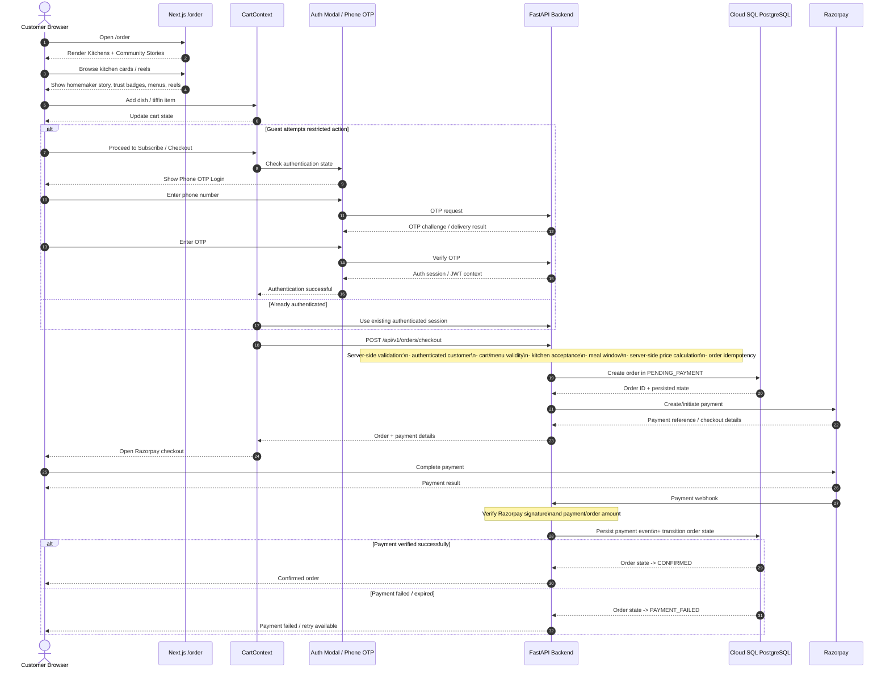
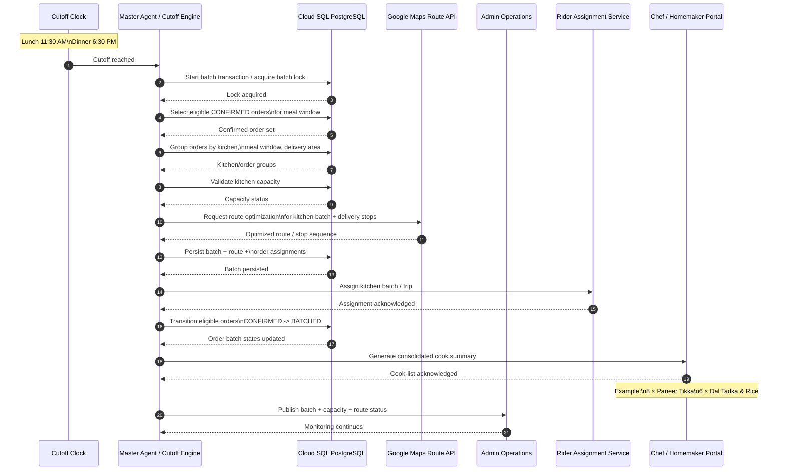
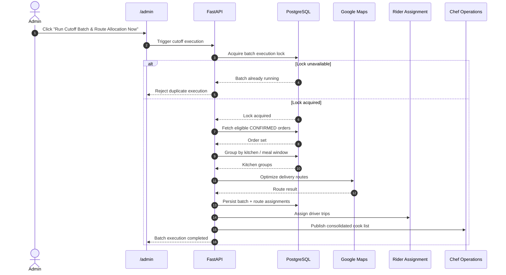
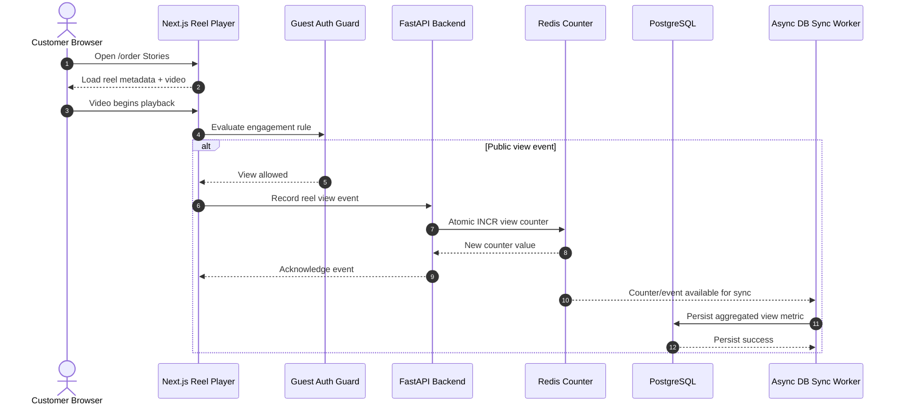
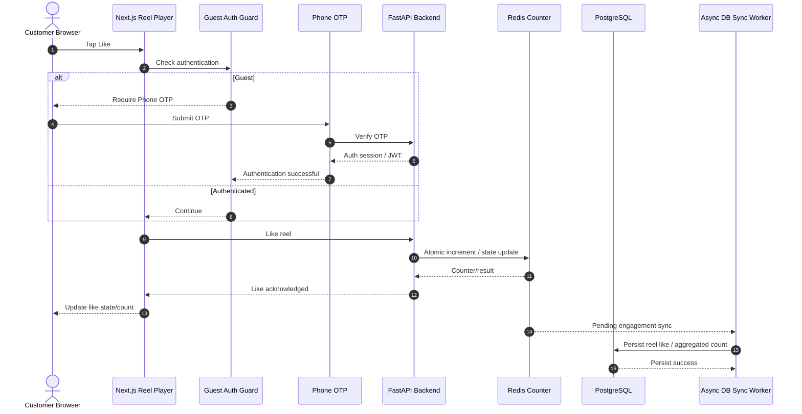

# HOMAATRI — CRITICAL SYSTEM SEQUENCE DIAGRAMS & CONTROL FLOWS
## Lead Systems Architecture Specification

**Document Version:** 1.0  
**Basis:** `Homaatri_Full_Stack_BRD_SRS_v1.md`  
**Scope:** Three critical platform flows  
**Frontend:** Next.js 14  
**Backend:** Python FastAPI  
**Database:** GCP Cloud SQL PostgreSQL  
**Supporting Services:** Redis, GCP Cloud Storage  
**External Integrations:** Razorpay, Google Maps API

---

# 0. Architecture Note

This document is derived directly from the current Homaatri BRD/SRS.

The BRD/SRS explicitly defines:
- the customer guest/authentication model;
- the `/order` customer portal;
- `POST /api/v1/orders/checkout`;
- Razorpay payment initiation and webhook verification;
- order states;
- lunch/dinner cutoffs;
- admin cutoff batching;
- route optimization using Google Maps;
- rider assignment;
- chef consolidated cooking summaries;
- Redis as a target supporting service;
- social interactions such as likes/reels.

However, the BRD/SRS explicitly states that:
- the complete API catalog is not yet defined;
- formal webhook contracts are not yet defined;
- exact Redis usage is not yet defined;
- the exact asynchronous event/queue mechanism is not yet defined;
- social schemas are not yet fully defined.

Accordingly, this document uses **TBD** labels wherever an exact interface is not established by the source rather than presenting inferred interfaces as approved contracts.

---

# 1. GUEST DISCOVERY TO ORDER CHECKOUT FLOW

## 1.1 Business Intent

A guest customer should be able to discover kitchens, watch community content, inspect homemaker profiles, and view menus without authentication.

Authentication is triggered only when the guest attempts a restricted action such as:
- add to cart;
- subscribe/order;
- like;
- comment;
- review;
- follow.

The requested flow focuses on:

```text
Guest Discovery
    ↓
Kitchen / Reel / Menu Exploration
    ↓
Add to Cart
    ↓
Phone OTP Authentication
    ↓
Checkout
    ↓
FastAPI validates cart + pricing
    ↓
Razorpay payment initiation
    ↓
Razorpay payment result/webhook
    ↓
FastAPI verifies payment
    ↓
PostgreSQL order state = CONFIRMED
```

The BRD/SRS defines the public discovery boundary and explicitly names `POST /api/v1/orders/checkout` as the checkout API. It also requires server-side price validation, idempotent payment handling, webhook verification, and persistent auditability.

---

## 1.2 Mermaid Sequence Diagram



---

## 1.3 Step-by-Step Control Flow

### Step 1 — Guest Discovery

The customer enters `/order`.

The customer is allowed to:
- browse Kitchens;
- swipe/scroll homemaker cards;
- watch Community Stories;
- inspect full profiles;
- view menus and prices.

Authentication is not required for these discovery actions.

### Step 2 — Cart Interaction

The customer adds a dish/tiffin item into `CartContext`.

The cart should maintain enough client-side state to render:
- selected item;
- quantity;
- meal window;
- dietary note;
- subtotal.

The cart is **not** the source of truth for price or order validity.

### Step 3 — Authentication Boundary

If the customer attempts:
- Add to Cart where authentication is enforced;
- Subscribe;
- Order;
- Like;
- Comment;
- Review;
- Follow;

the guest authentication guard launches the Phone OTP flow.

The BRD/SRS explicitly follows the rule:

> **Consumption is public; contribution/transaction requires authentication.**

### Step 4 — Checkout API

The authenticated client calls:

```http
POST /api/v1/orders/checkout
```

The backend must validate:
- customer authentication;
- cart validity;
- menu item availability;
- meal window;
- kitchen status;
- server-side pricing;
- delivery address;
- duplicate/duplicate-request protection.

### Step 5 — Create Pending Payment Order

The backend persists the order as:

```text
PENDING_PAYMENT
```

This is a server-owned state.

### Step 6 — Razorpay Payment Initiation

The backend creates/initates the payment transaction through Razorpay.

The exact Razorpay SDK/API version and payload are not defined in the BRD/SRS and therefore remain a technical-design item.

### Step 7 — Customer Completes Payment

The customer completes the payment through Razorpay.

The browser's payment result is not sufficient to make the order authoritative.

### Step 8 — Razorpay Webhook

Razorpay sends a payment webhook to the backend.

The backend must:
1. verify the webhook signature;
2. identify the corresponding order/payment;
3. verify the paid amount;
4. ensure the event has not already been processed.

### Step 9 — Authoritative Order State Transition

If payment is verified:

```text
PENDING_PAYMENT → CONFIRMED
```

If payment fails or expires:

```text
PENDING_PAYMENT → PAYMENT_FAILED
```

The source-defined order lifecycle also permits cancellation.

### Step 10 — Customer Confirmation

The customer sees the authoritative order result from the application/backend, not merely the client-side payment screen.

---

## 1.4 Checkout Control Rules

| Rule | Control |
|---|---|
| Guest cannot transact | Authentication guard |
| Client cannot determine final price | Server-side pricing |
| Duplicate checkout must not create duplicate orders | Idempotency |
| Payment success cannot be trusted from browser alone | Razorpay webhook verification |
| Duplicate webhook must not duplicate state changes | Idempotent event handling |
| Unavailable kitchen/menu item must not be ordered | Backend validation |
| Final order state comes from backend | PostgreSQL persisted state |

---

# 2. MEAL CUTOFF & ROUTE BATCHING EXECUTION FLOW

## 2.1 Business Intent

Homaatri is organized around recurring meal windows.

Current cutoffs:
- **Lunch — 11:30 AM**
- **Dinner — 6:30 PM**

At the cutoff, the system must consolidate confirmed orders into meal-window batches, coordinate kitchen workloads, optimize delivery routes, assign riders, and produce the consolidated cook list required by the homemaker.

The BRD/SRS defines:
- a cutoff engine;
- manual admin trigger;
- route allocation;
- Google Maps optimization;
- kitchen capacity monitoring;
- rider assignment;
- consolidated cook summary.

The exact production scheduling mechanism is not fully defined, so this sequence uses the source-defined logical responsibilities rather than asserting a specific job scheduler implementation.

---

## 2.2 Mermaid Sequence Diagram



---

## 2.3 Manual Admin Trigger Variant

The BRD/SRS explicitly supports a manual admin action:

> `Run Cutoff Batch & Route Allocation Now`

That creates an additional trigger path.



---

## 2.4 Step-by-Step Control Flow

### Step 1 — Cutoff Event

At the configured meal cutoff:
- Lunch: 11:30 AM
- Dinner: 6:30 PM

the cutoff engine initiates batch processing.

### Step 2 — Acquire Batch Lock

The backend must establish a single authoritative execution context for the meal-window batch.

Purpose:
- prevent duplicate batch runs;
- prevent two workers/admin actions from batching the same orders twice.

The exact lock implementation is **TBD**.

It may be:
- PostgreSQL advisory lock;
- row-level locking;
- distributed lock;
- another transactional mechanism.

Do not treat Redis as automatically being the lock provider; the BRD/SRS only identifies Redis as a target supporting service.

### Step 3 — Select Eligible Orders

The batch engine selects orders that are:

```text
status = CONFIRMED
AND
meal_window = current_window
AND
eligible_for_batch = true
```

### Step 4 — Group by Operational Dimensions

Orders are consolidated by at least:
- kitchen;
- meal window;
- delivery area / route grouping.

### Step 5 — Validate Capacity

Kitchen daily/window capacity must be checked.

The system should prevent the batching workflow from exceeding committed kitchen capacity.

### Step 6 — Route Optimization

The route service sends the relevant delivery stops to Google Maps route optimization.

Output:
- optimized stop sequence;
- route/trip information.

### Step 7 — Persist Batch

The backend persists:
- batch identifier;
- route identifier;
- orders included;
- kitchen;
- assigned rider;
- meal window;
- stop ordering.

### Step 8 — Transition Orders

Eligible confirmed orders transition:

```text
CONFIRMED → BATCHED
```

### Step 9 — Assign Driver

The platform assigns a rider to the kitchen-specific batch.

The BRD/SRS currently specifies:

> **1 Chef : 1 Driver Allocation**

for each meal window.

### Step 10 — Generate Chef Cook List

The kitchen receives an aggregated cooking workload instead of requiring the homemaker to manually inspect every order.

Example:

```text
8 × Paneer Tikka Tiffins
6 × Dal Tadka & Jeera Rice
```

This is a key operational efficiency feature.

---

## 2.5 Cutoff Control Matrix

| Control | Requirement |
|---|---|
| Meal windows | Lunch / Dinner |
| Cutoffs | 11:30 AM / 6:30 PM |
| Eligible orders | Confirmed orders in current meal window |
| Batch execution | Automated cutoff + manual admin trigger |
| Locking | Single authoritative batch execution |
| Grouping | Kitchen + meal window + delivery grouping |
| Capacity | Must be respected |
| Route optimization | Google Maps API |
| Driver allocation | Kitchen-specific batch |
| Order transition | CONFIRMED → BATCHED |
| Chef output | Consolidated cook summary |
| Audit | Batch execution must be auditable |

---

# 3. COMMUNITY REEL ENGAGEMENT FLOW

## 3.1 Business Intent

The customer portal combines:
- kitchen discovery;
- community cooking reels;
- homemaker storytelling;
- social engagement;
- direct commerce.

Guest users may watch reels.

Authenticated users may:
- like;
- comment;
- follow;
- review;
- order/subscribe.

The source BRD/SRS explicitly identifies Redis as a target supporting service and references future social schemas such as:
- `chef_reels`;
- `reel_comments`;
- `reel_likes`.

However, the BRD/SRS does **not** explicitly approve Redis atomic counters or an asynchronous persistence strategy.

Therefore the requested "Redis Atomic Counter -> Async DB Sync" flow is represented below as a **target architecture pattern**, marked accordingly.

---

## 3.2 Mermaid Sequence Diagram — Reel View



---

## 3.3 Mermaid Sequence Diagram — Reel Like



---

## 3.4 Step-by-Step Control Flow

### Step 1 — Reel Discovery

A guest opens:

```text
/order?tab=stories
```

The reel player loads local homemaker content.

### Step 2 — View Event

Viewing is public.

A view event can be sent to the backend.

### Step 3 — Redis Counter

The requested target architecture uses Redis for atomic counting.

Conceptually:

```text
INCR reel:view:{reel_id}
```

This prevents concurrent increments from colliding.

### Step 4 — Asynchronous Persistence

The incremented count can be synchronized to PostgreSQL asynchronously rather than performing a full relational write on every client event.

The exact queue/worker mechanism is **TBD** because the BRD/SRS does not define the event bus.

### Step 5 — Like Event

A like is an authenticated social action.

If the customer is a guest:
- Guest Auth Guard opens Phone OTP login;
- authentication completes;
- original like intent resumes.

### Step 6 — Backend Like Validation

The backend validates:
- authenticated customer;
- reel existence;
- like-state rules;
- duplicate like handling.

### Step 7 — Redis Engagement Update

The requested architecture can update an atomic counter/state in Redis.

### Step 8 — Async DB Sync

The event/count is later persisted into PostgreSQL.

The source BRD/SRS explicitly identifies future social schemas:

```text
chef_reels
reel_comments
reel_likes
```

but does not define their exact schema.

---

# 4. REEL ENGAGEMENT ACCESS MATRIX

| Action | Guest | Authenticated |
|---|---:|---:|
| Watch reel | Yes | Yes |
| View reel metadata | Yes | Yes |
| Count a view | Yes | Yes |
| Like | No | Yes |
| Comment | No | Yes |
| Follow chef | No | Yes |
| Review | No | Yes |
| Order dish from reel | No | Yes |

---

# 5. ASYNC REEL COUNTER ARCHITECTURE — TECHNICAL NOTE

The requested flow says:

```text
Reel Player
→ Guest Auth Guard
→ FastAPI
→ Redis Atomic Counter
→ Async DB Sync
```

This is a reasonable scalable architecture, but **the current BRD/SRS does not yet mandate it**.

What the BRD/SRS actually states is:
- Redis is a target supporting service;
- social schemas are future/TBD;
- the exact event bus/queue mechanism is TBD;
- reel likes/views/comments are required product behavior.

Therefore:

### Committed requirement
Social engagement must exist.

### Proposed technical architecture
Redis atomic counters + asynchronous database synchronization.

### Still to finalize
- Redis key strategy;
- TTL/expiry policy;
- idempotent view semantics;
- unique-like semantics;
- sync frequency;
- queue/worker technology;
- replay strategy;
- eventual-consistency tolerance;
- reconciliation job.

---

# 6. FAILURE AND RETRY CONTROL

## 6.1 Checkout

If payment gateway is unavailable:

```text
PENDING_PAYMENT
```

must not automatically become `CONFIRMED`.

If webhook delivery is delayed:
- order remains pending until verified;
- webhook handler must be retry-safe.

## 6.2 Cutoff Batching

If Google Maps route optimization fails:
- do not incorrectly mark orders as batched if route assignment is mandatory;
- escalate to admin/HITL;
- allow controlled retry.

Exact fallback-routing policy is TBD.

## 6.3 Reel Engagement

If Redis is unavailable:
- the UI should not falsely claim a persistent social action succeeded if persistence is required;
- fallback behavior is an implementation decision.

The current BRD/SRS does not define the exact resilience fallback for Redis.

---

# 7. CROSS-FLOW INTEGRATION VIEW

```mermaid
flowchart LR
    A[Guest Discovery] --> B[Authenticated Checkout]
    B --> C[PENDING_PAYMENT]
    C --> D[Payment Verified]
    D --> E[CONFIRMED]

    E --> F[Meal Cutoff]
    F --> G[BATCHED]
    G --> H[Route Optimization]
    H --> I[Driver Assigned]
    I --> J[Chef Cook List]
    J --> K[Pickup]
    K --> L[OUT_FOR_DELIVERY]
    L --> M[DELIVERED]

    N[Community Reel] --> O[Audience Engagement]
    O --> P[Trust / Discovery]
    P --> A
```



This represents an important product-level loop:

> **Community discovery can create customer intent; checkout converts intent into demand; cutoff batching converts demand into predictable kitchen production and route-based delivery.**

---

# 8. CONTROL OWNERSHIP SUMMARY

| Control Area | Primary Owner |
|---|---|
| Guest/auth state | Next.js + FastAPI |
| Cart display state | CartContext |
| Authentication decision | Guest Auth Guard + backend |
| Price validation | FastAPI |
| Payment truth | Razorpay webhook + FastAPI |
| Persistent order state | PostgreSQL |
| Cutoff trigger | Cutoff Engine / Admin |
| Batch lock | Backend transactional mechanism — TBD |
| Route optimization | Google Maps API |
| Driver assignment | FastAPI/Admin operations |
| Cook list generation | Backend aggregation |
| Reel engagement UI | Next.js |
| Social authorization | Auth Guard + FastAPI |
| Engagement counter | Redis — proposed architecture |
| Durable social persistence | PostgreSQL — exact schema TBD |
| Exception escalation | Admin/HITL |

---

# 9. ARCHITECTURAL RULES

## Rule 1 — Backend Owns Business State

Next.js can present or request a state transition.

FastAPI is the authority that:
- validates;
- authorizes;
- persists;
- transitions.

## Rule 2 — Payment Provider Is External Authority, Database Is Platform Authority

Razorpay confirms payment.

Homaatri PostgreSQL records the resulting Homaatri order state.

## Rule 3 — Batch Execution Must Be Idempotent

A duplicate cutoff trigger must not:
- double-batch orders;
- assign two drivers;
- create duplicate routes;
- duplicate cook-list quantities.

## Rule 4 — Capacity Must Be Server-Enforced

Frontend capacity counts are informative only.

The backend must enforce kitchen capacity.

## Rule 5 — Social Engagement Must Be Authorization-Aware

Watching is public.

Interaction is authenticated.

## Rule 6 — High-Volume Engagement Can Be Eventually Consistent

If Redis counters are adopted, PostgreSQL social metrics may be asynchronously synchronized.

However, the exact consistency SLA remains a technical design decision.

---

# 10. REQUIRED FOLLOW-UP TECHNICAL ARTIFACTS

To turn these sequences into implementation-ready contracts, the next architecture artifacts should include:

1. **OpenAPI specification**
   - checkout;
   - payment;
   - order transitions;
   - cutoff execution;
   - kitchen controls;
   - rider controls;
   - dietary negotiation;
   - social engagement.

2. **Formal webhook specification**
   - Razorpay events;
   - signature validation;
   - retry rules;
   - idempotency.

3. **Order state machine + reconciliation**
   - order;
   - kitchen;
   - rider;
   - payment.

4. **Batch transaction design**
   - locking;
   - concurrency;
   - idempotency;
   - rollback.

5. **Redis event/counter design**
   - key schema;
   - atomic operations;
   - queue/worker;
   - persistence strategy;
   - reconciliation.

6. **Canonical PostgreSQL ERD**
   - orders;
   - subscriptions;
   - payments;
   - kitchens;
   - capacities;
   - routes;
   - riders;
   - reels;
   - likes/comments/follows.

---

# 11. Source Alignment

The BRD/SRS defines:
- the customer dual-level discovery experience;
- guest/auth boundaries;
- checkout via `POST /api/v1/orders/checkout`;
- payment verification and idempotency principles;
- the order lifecycle;
- lunch/dinner cutoff execution;
- route optimization and rider allocation;
- consolidated chef cooking summaries;
- Redis as a target supporting service;
- social engagement capabilities;
- and the need for future formal API/webhook/data-model artifacts.

These source-defined requirements are the basis for the flows above. fileciteturn3file0L438-L512 fileciteturn3file0L537-L569 fileciteturn4file0L113-L163 fileciteturn4file0L276-L340

Where the requested flow assumes a specific implementation pattern not yet defined in the BRD/SRS — especially Redis atomic counters and asynchronous DB synchronization — it is explicitly marked as a **proposed technical architecture**, not an existing contractual requirement.
