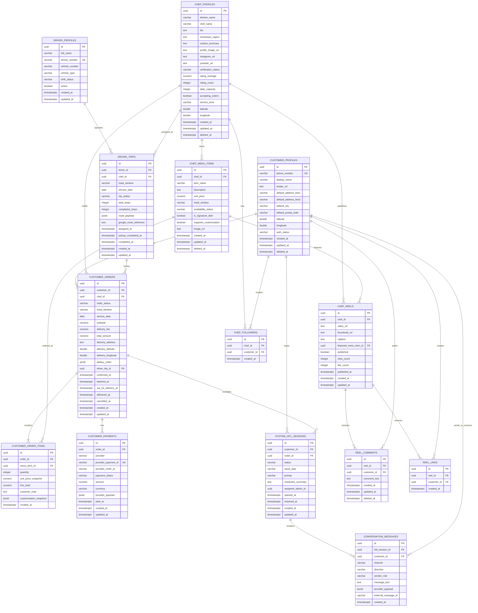

# HOMAATRI — DATABASE ERD & DATA DICTIONARY
## PostgreSQL Logical / Physical Design Specification

**Document Version:** 1.0  
**Basis:** `Homaatri_Full_Stack_BRD_SRS_v1.md`  
**Role:** Senior Database Engineering  
**Primary Database:** GCP Cloud SQL PostgreSQL

---

# 1. Database Design Position

The BRD/SRS establishes PostgreSQL on GCP Cloud SQL as the primary persistent datastore, but explicitly states that the canonical relational schema, exact columns, constraints, indexes, enum strategy, and foreign keys still require database design.

Therefore, this document is a **proposed database design baseline** aligned to the requested table names and the functional concepts in the BRD/SRS.

Where the source does not define an exact field, type, cascade policy, or index, the choice below is an engineering recommendation and should be reviewed before production migration.

The requested tables are:

### Core operational tables
- `customer_profiles`
- `chef_profiles`
- `chef_menu_items`
- `customer_orders`
- `customer_order_items`
- `customer_payments`
- `driver_profiles`
- `driver_trips`
- `system_hitl_sessions`
- `conversation_messages`

### Social/community tables
- `chef_reels`
- `reel_comments`
- `reel_likes`
- `chef_followers`

---

# 2. Design Conventions

| Convention | Recommendation |
|---|---|
| PKs | UUID |
| Timestamps | `timestamptz` in UTC |
| Money | `numeric(12,2)` |
| Statuses | PostgreSQL enums or constrained `varchar`; enum is recommended for stable lifecycle states |
| Coordinates | `double precision` for baseline latitude/longitude; PostGIS `geography(Point,4326)` recommended if spatial queries are planned |
| Soft deletion | Prefer `deleted_at` over physical deletion for business records |
| FK deletion | Cascade only for true child records that have no independent business value |
| Audit fields | `created_at`, `updated_at` on mutable entities |
| IDs exposed externally | UUIDs rather than sequential IDs |
| JSON | `jsonb` for extensible notes/provider payloads |

---

# 3. Mermaid.js ERD



---

# 4. PostgreSQL Table Specifications

## 4.1 `customer_profiles`

### Purpose
Stores the customer identity and default delivery/customer-facing profile.

| Column | Type | Constraints | Notes |
|---|---|---|---|
| `id` | `uuid` | PK, NOT NULL | Application UUID |
| `phone_number` | `varchar(20)` | UNIQUE, NOT NULL | Authentication identity |
| `display_name` | `varchar(120)` | NULL | Customer display name |
| `avatar_url` | `text` | NULL | Profile image |
| `default_address_line1` | `varchar(255)` | NULL | Default address |
| `default_address_line2` | `varchar(255)` | NULL | Optional |
| `default_city` | `varchar(100)` | NULL | Default city |
| `default_postal_code` | `varchar(20)` | NULL | Postal code |
| `latitude` | `double precision` | NULL | Default address latitude |
| `longitude` | `double precision` | NULL | Default address longitude |
| `auth_status` | `varchar(30)` | NOT NULL | Active/pending/blocked |
| `created_at` | `timestamptz` | NOT NULL | UTC |
| `updated_at` | `timestamptz` | NOT NULL | UTC |
| `deleted_at` | `timestamptz` | NULL | Soft deletion |

### Recommended constraints
- `phone_number` must be normalized.
- latitude between `-90` and `90`.
- longitude between `-180` and `180`.

---

# 4.2 `chef_profiles`

### Purpose
Stores homemaker/kitchen identity, trust, capacity and operational state.

| Column | Type | Constraints | Notes |
|---|---|---|---|
| `id` | `uuid` | PK | Chef/kitchen identity |
| `kitchen_name` | `varchar(150)` | NOT NULL | Public kitchen brand |
| `chef_name` | `varchar(120)` | NOT NULL | Homemaker display name |
| `bio` | `text` | NULL | Story |
| `hometown_region` | `varchar(100)` | NULL | Regional identity |
| `cuisine_summary` | `text` | NULL | Cuisine description |
| `profile_image_url` | `text` | NULL | Image |
| `instagram_url` | `text` | NULL | Verified social link |
| `youtube_url` | `text` | NULL | Verified social link |
| `verification_status` | `varchar(30)` | NOT NULL | Verification lifecycle |
| `rating_average` | `numeric(3,2)` | NOT NULL DEFAULT 0 | Aggregated rating |
| `rating_count` | `integer` | NOT NULL DEFAULT 0 | Rating count |
| `daily_capacity` | `integer` | NOT NULL | Capacity guard |
| `accepting_orders` | `boolean` | NOT NULL DEFAULT false | Kitchen master toggle |
| `service_area` | `varchar(255)` | NULL | Serving geography |
| `latitude` | `double precision` | NULL | Kitchen coordinate |
| `longitude` | `double precision` | NULL | Kitchen coordinate |
| `created_at` | `timestamptz` | NOT NULL | UTC |
| `updated_at` | `timestamptz` | NOT NULL | UTC |
| `deleted_at` | `timestamptz` | NULL | Soft deletion |

### Recommended constraints
- `daily_capacity >= 0`
- `rating_average >= 0 AND rating_average <= 5`
- `rating_count >= 0`
- latitude/longitude valid ranges.

---

# 4.3 `chef_menu_items`

### Purpose
Stores individual dishes offered by a homemaker.

| Column | Type | Constraints | Notes |
|---|---|---|---|
| `id` | `uuid` | PK | Menu item |
| `chef_id` | `uuid` | FK → `chef_profiles.id`, NOT NULL | Owner kitchen |
| `item_name` | `varchar(150)` | NOT NULL | Public dish name |
| `description` | `text` | NULL | Description |
| `unit_price` | `numeric(12,2)` | NOT NULL | Current price |
| `meal_window` | `varchar(20)` | NOT NULL | `LUNCH` / `DINNER` |
| `availability_status` | `varchar(20)` | NOT NULL | `IN_STOCK` / `SOLD_OUT` |
| `is_signature_dish` | `boolean` | NOT NULL DEFAULT false | Featured item |
| `supports_customization` | `boolean` | NOT NULL DEFAULT false | Dietary requests |
| `image_url` | `text` | NULL | Dish image |
| `created_at` | `timestamptz` | NOT NULL | UTC |
| `updated_at` | `timestamptz` | NOT NULL | UTC |
| `deleted_at` | `timestamptz` | NULL | Soft deletion |

### FK rule
`chef_id` should use **ON DELETE RESTRICT** because deleting a chef with historical menu references should normally be a business-controlled operation.

---

# 4.4 `customer_orders`

### Purpose
Authoritative customer order record and order lifecycle state.

| Column | Type | Constraints | Notes |
|---|---|---|---|
| `id` | `uuid` | PK | Order ID |
| `customer_id` | `uuid` | FK → `customer_profiles.id`, NOT NULL | Buyer |
| `chef_id` | `uuid` | FK → `chef_profiles.id`, NOT NULL | Fulfillment kitchen |
| `order_status` | `varchar(30)` | NOT NULL | DRAFT/PENDING_PAYMENT/CONFIRMED/BATCHED/OUT_FOR_DELIVERY/DELIVERED/CANCELLED/PAYMENT_FAILED |
| `meal_window` | `varchar(20)` | NOT NULL | Lunch/Dinner |
| `service_date` | `date` | NOT NULL | Meal service date |
| `subtotal` | `numeric(12,2)` | NOT NULL | Items subtotal |
| `delivery_fee` | `numeric(12,2)` | NOT NULL | Delivery component |
| `total_amount` | `numeric(12,2)` | NOT NULL | Final order amount |
| `delivery_address` | `text` | NOT NULL | Snapshotted delivery address |
| `delivery_latitude` | `double precision` | NULL | Delivery latitude |
| `delivery_longitude` | `double precision` | NULL | Delivery longitude |
| `dietary_notes` | `jsonb` | NULL | Order-level notes |
| `driver_trip_id` | `uuid` | FK → `driver_trips.id`, NULL | Assigned trip |
| `confirmed_at` | `timestamptz` | NULL | Confirmation timestamp |
| `batched_at` | `timestamptz` | NULL | Batch timestamp |
| `out_for_delivery_at` | `timestamptz` | NULL | Dispatch timestamp |
| `delivered_at` | `timestamptz` | NULL | Completion timestamp |
| `cancelled_at` | `timestamptz` | NULL | Cancellation timestamp |
| `created_at` | `timestamptz` | NOT NULL | UTC |
| `updated_at` | `timestamptz` | NOT NULL | UTC |

### Recommended constraints
- `subtotal >= 0`
- `delivery_fee >= 0`
- `total_amount >= 0`
- `total_amount = subtotal + delivery_fee` should be validated at application/service level to allow for future discounts/taxes.
- service date should be validated against business rules.

### FK rules
- `customer_id`: **ON DELETE RESTRICT**
- `chef_id`: **ON DELETE RESTRICT**
- `driver_trip_id`: **ON DELETE SET NULL**

Historical orders should not disappear because an actor profile is deleted.

---

# 4.5 `customer_order_items`

### Purpose
Immutable snapshot of what the customer purchased.

| Column | Type | Constraints | Notes |
|---|---|---|---|
| `id` | `uuid` | PK | Line item |
| `order_id` | `uuid` | FK → `customer_orders.id`, NOT NULL | Parent order |
| `menu_item_id` | `uuid` | FK → `chef_menu_items.id`, NOT NULL | Referenced dish |
| `quantity` | `integer` | NOT NULL | Ordered quantity |
| `unit_price_snapshot` | `numeric(12,2)` | NOT NULL | Price at purchase time |
| `line_total` | `numeric(12,2)` | NOT NULL | Quantity × unit price |
| `customer_note` | `text` | NULL | Item-specific note |
| `customization_snapshot` | `jsonb` | NULL | Accepted customization state |
| `created_at` | `timestamptz` | NOT NULL | UTC |

### FK rules
- `order_id`: **ON DELETE CASCADE**
- `menu_item_id`: **ON DELETE RESTRICT**

Order items are dependent children of the order.

---

# 4.6 `customer_payments`

### Purpose
Payment-provider record and payment audit trail.

| Column | Type | Constraints | Notes |
|---|---|---|---|
| `id` | `uuid` | PK | Internal payment ID |
| `order_id` | `uuid` | FK → `customer_orders.id`, NOT NULL | Related order |
| `provider` | `varchar(30)` | NOT NULL | `RAZORPAY` |
| `provider_payment_id` | `varchar(120)` | UNIQUE | External payment ID |
| `provider_order_id` | `varchar(120)` | NULL | External gateway order ID |
| `payment_status` | `varchar(30)` | NOT NULL | Pending/success/failed/refunded etc. |
| `amount` | `numeric(12,2)` | NOT NULL | Paid amount |
| `currency` | `varchar(10)` | NOT NULL | Expected `INR` |
| `provider_payload` | `jsonb` | NULL | Raw/sanitized provider response |
| `paid_at` | `timestamptz` | NULL | Success time |
| `created_at` | `timestamptz` | NOT NULL | UTC |
| `updated_at` | `timestamptz` | NOT NULL | UTC |

### FK rule
`order_id` → **ON DELETE CASCADE** is acceptable only if payment rows are considered private order implementation artifacts. For financial/audit retention, **ON DELETE RESTRICT** is preferred.

Recommended production policy:
> **Do not cascade-delete payment records from business history.**

---

# 4.7 `driver_profiles`

### Purpose
Stores rider identity and shift availability.

| Column | Type | Constraints | Notes |
|---|---|---|---|
| `id` | `uuid` | PK | Rider |
| `full_name` | `varchar(120)` | NOT NULL | Name |
| `phone_number` | `varchar(20)` | UNIQUE, NOT NULL | Rider contact |
| `vehicle_number` | `varchar(40)` | NULL | Registration |
| `vehicle_type` | `varchar(40)` | NULL | Bike/car/etc. |
| `shift_status` | `varchar(30)` | NOT NULL | OFF_SHIFT / ON_SHIFT_WAITING |
| `active` | `boolean` | NOT NULL DEFAULT true | Operational availability |
| `created_at` | `timestamptz` | NOT NULL |
| `updated_at` | `timestamptz` | NOT NULL |

---

# 4.8 `driver_trips`

### Purpose
Represents the meal-window-specific driver batch/trip.

| Column | Type | Constraints | Notes |
|---|---|---|---|
| `id` | `uuid` | PK | Trip/batch ID |
| `driver_id` | `uuid` | FK → `driver_profiles.id`, NOT NULL | Assigned rider |
| `chef_id` | `uuid` | FK → `chef_profiles.id`, NOT NULL | Kitchen |
| `meal_window` | `varchar(20)` | NOT NULL | Lunch/Dinner |
| `service_date` | `date` | NOT NULL | Service date |
| `trip_status` | `varchar(30)` | NOT NULL | ASSIGNED_BATCH/PICKUP_COMPLETED/DELIVERIES_IN_PROGRESS/BATCH_COMPLETED |
| `total_stops` | `integer` | NOT NULL DEFAULT 0 | Planned stops |
| `completed_stops` | `integer` | NOT NULL DEFAULT 0 | Completed |
| `route_payload` | `jsonb` | NULL | Google Maps route response snapshot |
| `google_route_reference` | `text` | NULL | Provider reference |
| `assigned_at` | `timestamptz` | NULL |
| `pickup_completed_at` | `timestamptz` | NULL |
| `completed_at` | `timestamptz` | NULL |
| `created_at` | `timestamptz` | NOT NULL |
| `updated_at` | `timestamptz` | NOT NULL |

### FK rules
- `driver_id`: **ON DELETE RESTRICT**
- `chef_id`: **ON DELETE RESTRICT**

Historical trips should remain auditable.

---

# 4.9 `system_hitl_sessions`

### Purpose
Human-in-the-loop support/escalation session.

| Column | Type | Constraints | Notes |
|---|---|---|---|
| `id` | `uuid` | PK | HITL session |
| `customer_id` | `uuid` | FK → `customer_profiles.id`, NOT NULL | Customer |
| `order_id` | `uuid` | FK → `customer_orders.id`, NULL | Related order |
| `status` | `varchar(30)` | NOT NULL | OPEN/IN_PROGRESS/RESOLVED/CLOSED |
| `issue_type` | `varchar(50)` | NOT NULL | Delivery/payment/address/etc. |
| `priority` | `varchar(20)` | NOT NULL | LOW/MEDIUM/HIGH/CRITICAL |
| `resolution_summary` | `text` | NULL | Final resolution |
| `assigned_admin_id` | `uuid` | NULL | Admin identity; FK to admin table is TBD because admin profile table is not defined in the source |
| `opened_at` | `timestamptz` | NOT NULL |
| `resolved_at` | `timestamptz` | NULL |
| `created_at` | `timestamptz` | NOT NULL |
| `updated_at` | `timestamptz` | NOT NULL |

### FK rules
- `customer_id`: **ON DELETE RESTRICT**
- `order_id`: **ON DELETE SET NULL**

---

# 4.10 `conversation_messages`

### Purpose
Stores auditable Web/WhatsApp support communications associated with HITL sessions.

| Column | Type | Constraints | Notes |
|---|---|---|---|
| `id` | `uuid` | PK | Message |
| `hitl_session_id` | `uuid` | FK → `system_hitl_sessions.id`, NOT NULL | Parent escalation |
| `customer_id` | `uuid` | FK → `customer_profiles.id`, NOT NULL | Customer |
| `channel` | `varchar(20)` | NOT NULL | WEB / WHATSAPP |
| `direction` | `varchar(20)` | NOT NULL | INBOUND / OUTBOUND |
| `sender_role` | `varchar(30)` | NOT NULL | CUSTOMER / ADMIN / SYSTEM |
| `message_text` | `text` | NOT NULL | Message body |
| `provider_payload` | `jsonb` | NULL | Provider metadata |
| `external_message_id` | `varchar(150)` | NULL | Provider ID |
| `created_at` | `timestamptz` | NOT NULL | UTC |

### FK rules
- `hitl_session_id`: **ON DELETE CASCADE**
- `customer_id`: **ON DELETE RESTRICT**

---

# 5. SOCIAL & COMMUNITY TABLES

## 5.1 `chef_reels`

### Purpose
Stores homemaker cooking reels / community story content.

| Column | Type | Constraints | Notes |
|---|---|---|---|
| `id` | `uuid` | PK | Reel ID |
| `chef_id` | `uuid` | FK → `chef_profiles.id`, NOT NULL | Creator |
| `video_url` | `text` | NOT NULL | Cloud Storage/media URL |
| `thumbnail_url` | `text` | NULL | Thumbnail |
| `caption` | `text` | NULL | Caption |
| `featured_menu_item_id` | `uuid` | FK → `chef_menu_items.id`, NULL | Order-from-reel target |
| `published` | `boolean` | NOT NULL DEFAULT false | Visibility |
| `view_count` | `bigint` | NOT NULL DEFAULT 0 | Denormalized counter |
| `like_count` | `bigint` | NOT NULL DEFAULT 0 | Denormalized counter |
| `published_at` | `timestamptz` | NULL | Publish time |
| `created_at` | `timestamptz` | NOT NULL |
| `updated_at` | `timestamptz` | NOT NULL |

### FK rules
- `chef_id`: **ON DELETE RESTRICT**
- `featured_menu_item_id`: **ON DELETE SET NULL**

---

# 5.2 `reel_comments`

### Purpose
Customer comments on reels.

| Column | Type | Constraints | Notes |
|---|---|---|---|
| `id` | `uuid` | PK | Comment |
| `reel_id` | `uuid` | FK → `chef_reels.id`, NOT NULL | Parent reel |
| `customer_id` | `uuid` | FK → `customer_profiles.id`, NOT NULL | Commenter |
| `comment_text` | `text` | NOT NULL | Comment |
| `created_at` | `timestamptz` | NOT NULL |
| `updated_at` | `timestamptz` | NOT NULL |
| `deleted_at` | `timestamptz` | NULL | Soft deletion |

### FK rules
- `reel_id`: **ON DELETE CASCADE**
- `customer_id`: **ON DELETE RESTRICT**

---

# 5.3 `reel_likes`

### Purpose
One customer like relationship per reel.

| Column | Type | Constraints | Notes |
|---|---|---|---|
| `id` | `uuid` | PK | Like record |
| `reel_id` | `uuid` | FK → `chef_reels.id`, NOT NULL | Reel |
| `customer_id` | `uuid` | FK → `customer_profiles.id`, NOT NULL | User |
| `created_at` | `timestamptz` | NOT NULL | Like time |

### Critical constraint

```text
UNIQUE (reel_id, customer_id)
```

This prevents duplicate likes at the relational layer.

### FK rules
- `reel_id`: **ON DELETE CASCADE**
- `customer_id`: **ON DELETE RESTRICT**

---

# 5.4 `chef_followers`

### Purpose
Represents customer-to-homemaker follow relationships.

| Column | Type | Constraints | Notes |
|---|---|---|---|
| `id` | `uuid` | PK | Follow record |
| `chef_id` | `uuid` | FK → `chef_profiles.id`, NOT NULL | Followed chef |
| `customer_id` | `uuid` | FK → `customer_profiles.id`, NOT NULL | Follower |
| `created_at` | `timestamptz` | NOT NULL | Follow time |

### Critical constraint

```text
UNIQUE (chef_id, customer_id)
```

### FK rules
- `chef_id`: **ON DELETE CASCADE** may be acceptable for pure relationship data
- `customer_id`: **ON DELETE RESTRICT**

Recommended:
> Preserve customer follow relationships as long as possible; profile deactivation should generally use soft deletion rather than physical deletion.

---

# 6. Indexing & Performance

## 6.1 Core B-Tree Indexes

### `customer_orders`

```sql
CREATE INDEX idx_customer_orders_customer_created
ON customer_orders (customer_id, created_at DESC);

CREATE INDEX idx_customer_orders_status
ON customer_orders (order_status);

CREATE INDEX idx_customer_orders_chef_meal_status
ON customer_orders (chef_id, service_date, meal_window, order_status);

CREATE INDEX idx_customer_orders_service_window_status
ON customer_orders (service_date, meal_window, order_status);

CREATE INDEX idx_customer_orders_driver_trip
ON customer_orders (driver_trip_id);

CREATE INDEX idx_customer_orders_created_at
ON customer_orders (created_at DESC);
```

### Why

These support:
- customer order history;
- admin pipeline;
- chef workload aggregation;
- cutoff batch selection;
- route assignment;
- active delivery lookup.

---

## 6.2 `customer_order_items`

```sql
CREATE INDEX idx_order_items_order
ON customer_order_items (order_id);

CREATE INDEX idx_order_items_menu_item
ON customer_order_items (menu_item_id);
```

---

## 6.3 `customer_payments`

```sql
CREATE INDEX idx_customer_payments_order
ON customer_payments (order_id);

CREATE INDEX idx_customer_payments_status
ON customer_payments (payment_status);

CREATE INDEX idx_customer_payments_provider_order
ON customer_payments (provider_order_id);
```

`provider_payment_id` should have a UNIQUE constraint/index.

---

## 6.4 `chef_menu_items`

```sql
CREATE INDEX idx_chef_menu_items_chef_window
ON chef_menu_items (chef_id, meal_window, availability_status);

CREATE INDEX idx_chef_menu_items_signature
ON chef_menu_items (chef_id, is_signature_dish)
WHERE is_signature_dish = TRUE;
```

---

## 6.5 `chef_profiles`

```sql
CREATE INDEX idx_chef_profiles_accepting
ON chef_profiles (accepting_orders, verification_status);

CREATE INDEX idx_chef_profiles_region
ON chef_profiles (hometown_region);

CREATE INDEX idx_chef_profiles_service_area
ON chef_profiles (service_area);
```

For nearby-kitchen discovery, a spatial index is preferred over a plain latitude/longitude B-tree pair.

---

# 7. Spatial Indexing

## 7.1 Preferred Production Approach — PostGIS

Because the product explicitly requires nearby homemaker discovery and location-aware filtering, the preferred architecture is:

```sql
CREATE EXTENSION IF NOT EXISTS postgis;
```

Add:

```sql
ALTER TABLE chef_profiles
ADD COLUMN location geography(Point, 4326);
```

Populate `location` from:

```text
longitude + latitude
```

Then:

```sql
CREATE INDEX idx_chef_profiles_location_gist
ON chef_profiles
USING GIST (location);
```

Nearby search can then use PostGIS distance functions.

## 7.2 If PostGIS Is Deferred

The BRD/SRS only explicitly requires latitude/longitude.

A baseline fallback is:

```sql
CREATE INDEX idx_chef_profiles_lat_lon
ON chef_profiles (latitude, longitude);
```

and:

```sql
CREATE INDEX idx_customer_orders_delivery_lat_lon
ON customer_orders (delivery_latitude, delivery_longitude);
```

However, B-tree latitude/longitude indexes are not equivalent to a true spatial index for radius/distance queries.

### Recommendation

> Use PostGIS + GiST for production locality/radius discovery.

---

# 8. Social Indexing

## `chef_reels`

```sql
CREATE INDEX idx_chef_reels_chef_published
ON chef_reels (chef_id, published_at DESC)
WHERE published = TRUE;

CREATE INDEX idx_chef_reels_published
ON chef_reels (published_at DESC)
WHERE published = TRUE;

CREATE INDEX idx_chef_reels_featured_menu
ON chef_reels (featured_menu_item_id);
```

## `reel_comments`

```sql
CREATE INDEX idx_reel_comments_reel_created
ON reel_comments (reel_id, created_at DESC);

CREATE INDEX idx_reel_comments_customer
ON reel_comments (customer_id, created_at DESC);
```

## `reel_likes`

```sql
CREATE UNIQUE INDEX ux_reel_likes_reel_customer
ON reel_likes (reel_id, customer_id);

CREATE INDEX idx_reel_likes_customer
ON reel_likes (customer_id, created_at DESC);
```

## `chef_followers`

```sql
CREATE UNIQUE INDEX ux_chef_followers_chef_customer
ON chef_followers (chef_id, customer_id);

CREATE INDEX idx_chef_followers_customer
ON chef_followers (customer_id, created_at DESC);

CREATE INDEX idx_chef_followers_chef
ON chef_followers (chef_id, created_at DESC);
```

---

# 9. Rider / Operations Indexing

## `driver_profiles`

```sql
CREATE INDEX idx_driver_profiles_shift_active
ON driver_profiles (shift_status, active);
```

## `driver_trips`

```sql
CREATE INDEX idx_driver_trips_driver_service_date
ON driver_trips (driver_id, service_date, meal_window);

CREATE INDEX idx_driver_trips_chef_service_date
ON driver_trips (chef_id, service_date, meal_window);

CREATE INDEX idx_driver_trips_status
ON driver_trips (trip_status);

CREATE INDEX idx_driver_trips_active
ON driver_trips (service_date, meal_window, trip_status);
```

---

# 10. HITL / Conversation Indexing

## `system_hitl_sessions`

```sql
CREATE INDEX idx_hitl_sessions_status_priority
ON system_hitl_sessions (status, priority, opened_at DESC);

CREATE INDEX idx_hitl_sessions_customer
ON system_hitl_sessions (customer_id, opened_at DESC);

CREATE INDEX idx_hitl_sessions_order
ON system_hitl_sessions (order_id, opened_at DESC);

CREATE INDEX idx_hitl_sessions_assigned_admin
ON system_hitl_sessions (assigned_admin_id, status);
```

## `conversation_messages`

```sql
CREATE INDEX idx_conversation_messages_session_created
ON conversation_messages (hitl_session_id, created_at ASC);

CREATE INDEX idx_conversation_messages_customer_created
ON conversation_messages (customer_id, created_at DESC);

CREATE UNIQUE INDEX ux_conversation_messages_external
ON conversation_messages (external_message_id)
WHERE external_message_id IS NOT NULL;
```

---

# 11. Recommended Partial Indexes for Active Operations

Because Homaatri frequently queries only operationally active records, partial indexes are useful.

### Active kitchens

```sql
CREATE INDEX idx_active_verified_chefs
ON chef_profiles (service_area, accepting_orders)
WHERE deleted_at IS NULL
  AND accepting_orders = TRUE
  AND verification_status = 'VERIFIED';
```

### Active orders

```sql
CREATE INDEX idx_active_orders
ON customer_orders (service_date, meal_window, chef_id)
WHERE order_status IN (
    'CONFIRMED',
    'BATCHED',
    'OUT_FOR_DELIVERY'
);
```

### Pending payment

```sql
CREATE INDEX idx_pending_payment_orders
ON customer_orders (created_at)
WHERE order_status = 'PENDING_PAYMENT';
```

### Active rider trips

```sql
CREATE INDEX idx_active_driver_trips
ON driver_trips (service_date, meal_window, driver_id)
WHERE trip_status IN (
    'ASSIGNED_BATCH',
    'PICKUP_COMPLETED',
    'DELIVERIES_IN_PROGRESS'
);
```

---

# 12. State / Status Recommendation

The application should preferably use constrained enum-like values.

## Order

```text
DRAFT
PENDING_PAYMENT
CONFIRMED
BATCHED
OUT_FOR_DELIVERY
DELIVERED
CANCELLED
PAYMENT_FAILED
```

## Kitchen

The BRD/SRS identifies operational concepts equivalent to:

```text
KITCHEN_CLOSED
ACCEPTING_ORDERS
CAPACITY_REACHED
KITCHEN_PAUSED
```

These can be represented either as:
- a separate `kitchen_status`;
- or derived from `accepting_orders + daily_capacity + operational_pause`.

The canonical persistence design is TBD.

## Rider Trip

```text
ASSIGNED_BATCH
PICKUP_COMPLETED
DELIVERIES_IN_PROGRESS
BATCH_COMPLETED
```

## Payment

Suggested values:

```text
PENDING
SUCCESS
FAILED
REFUNDED
CANCELLED
```

## HITL

Suggested values:

```text
OPEN
IN_PROGRESS
RESOLVED
CLOSED
```

---

# 13. Referential Integrity & Delete Strategy

## Recommended policy

### Hard CASCADE
Use only for records with no independent business meaning:
- `customer_order_items` when an order itself is intentionally removed;
- `reel_comments` when a reel is physically removed;
- `reel_likes` when a reel is physically removed.

### RESTRICT
Use for historical/business entities:
- customer → orders;
- chef → orders;
- menu item → historical order lines;
- rider → trips;
- chef → trips;
- payment → order.

### SET NULL
Use when the parent should disappear from the live object but the historical child record remains:
- order → driver trip;
- reel → featured menu item;
- HITL → order.

### Soft Delete
For:
- customers;
- chefs;
- menu items;
- reels;

prefer:

```text
deleted_at
```

rather than physical deletion.

---

# 14. Data Dictionary — Consolidated Reference

| Table | Primary Business Purpose | Key Relationships | High-Value Indexes |
|---|---|---|---|
| `customer_profiles` | Customer identity/profile | Customer → Orders, Likes, Comments, Follows, HITL | Phone UNIQUE |
| `chef_profiles` | Homemaker/kitchen business identity | Chef → Menu, Orders, Trips, Reels, Followers | Active/verified + spatial |
| `chef_menu_items` | Dish catalog | Chef → Menu Items; Item → Order Lines | Chef + meal window + availability |
| `customer_orders` | Order lifecycle | Customer + Chef + Trip | Status, service date/window, chef |
| `customer_order_items` | Order line snapshots | Order + Menu Item | Order ID |
| `customer_payments` | Payment audit | Order → Payments | Order, status, provider ID |
| `driver_profiles` | Rider identity/status | Driver → Trips | Shift + active |
| `driver_trips` | Meal-window delivery batch | Rider + Chef + Orders | Service date/window/status |
| `system_hitl_sessions` | Human support/escalation | Customer + Order + Messages | Status/priority |
| `conversation_messages` | WhatsApp/Web communication audit | HITL + Customer | Session/time |
| `chef_reels` | Homemaker video content | Chef + Featured Menu Item | Published, chef |
| `reel_comments` | Reel discussion | Reel + Customer | Reel/time |
| `reel_likes` | Reel engagement | Reel + Customer | Unique reel/customer |
| `chef_followers` | Customer-to-chef relationship | Chef + Customer | Unique chef/customer |

---

# 15. Data Lifecycle Principles

## Orders and payments
Should be retained as historical business records.

## Menu items
Should generally be soft-deleted/inactivated rather than physically removed when historical order references exist.

## Reels
Should support soft deletion and media lifecycle cleanup.

## Likes/follows/comments
May be physically deleted for privacy or content moderation only if the policy permits; otherwise retain audit-safe records.

## Messages/HITL
Should be retained according to future customer-support and compliance retention policy.

---

# 16. Performance Considerations

The database must support the following high-frequency access patterns:

### Customer
- nearby kitchens;
- current menus;
- active meal windows;
- order history;
- tracking;
- reel feed;
- chef profiles.

### Homemaker
- current meal demand;
- cook summary;
- current orders;
- menu;
- active kitchen status.

### Rider
- active trip;
- immediate stop;
- completion state.

### Admin
- live order pipeline;
- kitchen capacity;
- active trips;
- escalations;
- chat stream.

### Important architectural rule

Do not run large, unbounded joins on operational dashboards.

Prefer:
- targeted indexes;
- pre-aggregated counters;
- pagination;
- materialized operational summaries where justified;
- Redis caching for high-frequency ephemeral counters/state where appropriate.

---

# 17. Social Counter Architecture Note

The BRD/SRS identifies Redis as a target supporting service and references social engagement.

If the implementation uses Redis counters for:
- reel views;
- reel likes;

then the PostgreSQL columns:

```text
chef_reels.view_count
chef_reels.like_count
```

are denormalized read models.

A recommended pattern is:

```text
Client Event
    ↓
FastAPI
    ↓
Redis atomic increment
    ↓
Async sync / periodic aggregation
    ↓
PostgreSQL
```

This is a **proposed technical architecture** and is not explicitly fixed by the BRD/SRS.

For likes specifically, PostgreSQL `reel_likes` remains the durable unique relationship table.

---

# 18. Data Integrity Controls

The application/service layer must enforce:

1. Order total is derived from authoritative prices.
2. Historical order item prices are snapshotted.
3. Duplicate reel likes are prevented with a unique constraint.
4. Duplicate follows are prevented with a unique constraint.
5. Payment provider IDs are unique.
6. Customer phone numbers are unique.
7. Rider phone numbers are unique.
8. Capacity cannot go negative.
9. Ratings cannot exceed configured range.
10. Delivery state must be consistent with trip state.

---

# 19. Recommended Future Extensions

The current BRD/SRS does not fully define these but the schema is expected to evolve toward:

- `admin_profiles`;
- `kitchen_capacity_windows`;
- `tiffin_subscriptions`;
- `subscription_orders`;
- `order_status_history`;
- `payment_events`;
- `delivery_stop_events`;
- `verification_records`;
- `chef_standard_audits`;
- `notifications`;
- `customer_addresses`;
- `dietary_negotiations`;
- `route_stops`;
- `audit_logs`.

These should be added through versioned schema changes after the relevant requirements are formally approved.

---

# 20. Engineering Summary

The recommended relational model centers on five domain groups:

```text
CUSTOMER
  ├── Orders
  ├── Payments
  ├── Likes
  ├── Comments
  ├── Follows
  └── Support/HITL

HOMEMAKER
  ├── Menu Items
  ├── Orders
  ├── Reels
  ├── Delivery Trips
  └── Followers

ORDER / COMMERCE
  ├── Orders
  ├── Order Items
  └── Payments

FULFILLMENT
  ├── Driver Profiles
  ├── Driver Trips
  └── Delivery-linked Orders

OPERATIONS / SOCIAL
  ├── HITL Sessions
  ├── Conversation Messages
  ├── Reels
  ├── Comments
  ├── Likes
  └── Follows
```

The source BRD/SRS explicitly establishes PostgreSQL as the primary datastore and identifies the logical entities above, while noting that the exact canonical schema, indexes and constraints require a dedicated database-design phase.

Therefore, this ERD should be treated as a **production-oriented proposed schema baseline**, followed by an approved migration/DDL package after stakeholder review.
